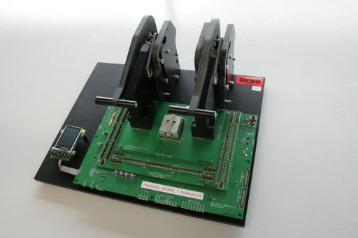

# dfrws2010-challenge
The DFRWS2010 Challenge Results Challenge offered a chance to perform forensic analysis of memory dumps from a Sony Ericsson mobile device. This challenge was designed to be accessible to a wide audience, combined accessible forensic analysis tasks with some harder problems. We were pleased that the submissions this year came from not just researchers and developers, but also practitioners in the community.  Some aspects of the challenge could not be completed using existing tools and new techniques had to be developed. However, many of the questions could be answered without developing new approaches.

## Scenario Background
After an extensive undercover operation, a known arms dealer named Monsieur Victor, commonly known as "The General," was lured out of hiding and apprehended in the Netherlands. He had expected a meeting to finalize a large sale of weapons, including tanks, missiles, attack helicopters, and assault rifles. Instead he met with police. When he realized the situations, he threw a mobile device in a nearby canal. The device was later retrieved by scuba divers, and was found to be a Sony Ericsson K800i Cybershot.

Mr. Victor has been connected with several front companies, and a fleet of military cargo planes used to deliver weaponry. He has openly mocked arms embargoes, and is suspected of selling arms to both sides in military conflicts around the globe. As a result of his brazen behavior of delivering large shipments to high risk regions all over the world, he developed a reputation as the "UPS of arms dealers." In some situations, he traded weapons in exchange for oil, copper, cobalt, uranium 294, 298, 380, thorium, titanium and other materials he could resell. However, in the past, investigators could not find sufficient evidence to link him to any arms deals. Despite regular surveillance by authorities, and efforts to monitoring of his communications, he managed to slip through the net of several sting operations. One of his methods of operation is to use stolen and/or throw away cell phones, making it more difficult for investigators to track and monitor his activities.

In the current operation, undercover investigators arranged an arms deal through one of Mr. Victor's front companies, Smurf Celtic. To convince him that the deal was real, an initial down payment was made by electronic funds transfer to Smelt Bank in France into an account owned by another front company named RipTide Security. His meeting in Amsterdam was to finalize the full payment to a bank account in Dubai.

After Mr. Victor's Sony Ericsson K800i Cybershot was retrieved, it was provided to the Netherlands Forensic Institute for processing. The Memory toolkit (shown below) was used to acquire the contents of NAND and NOR Flash memory from the device.

You have been asked to recover any evidence that can connect Monsieur Victor to the sale of arms through Smurf Celtic, and the receipt of payment to RipTide Security. In addition, you have been asked to recover any leads that might connect him to other individuals, companies, or bank accounts that are involved in Mr. Victor's international arms business.

## Challenge Data

The acquired data is contained in two files: SonyEricsson_K800i_NAND_NAND512R3A.bin and SonyEricsson_K800i_Norflash_PF38F5060M0Y0BE.dmp. Audit logs and hash values are also provided. These files can be found in a 33MB Zip file. *too big for github*

Additional data was released when the results were released and is available in [SonyEricsson_K800i.xry](SonyEricsson_K800i.xry). A reader for [the XRY file](XRY_Reader_5.0.1.zip) is also available.

## Submission Requirements

Submissions should include a detailed analysis in report format that presents:
- Evidence connecting Monsieur Victor to the sale of arms through Smurf Celtic.
- Evidence of the receipt of payment to RipTide Security.
- Recovery of any leads that might connect Monsieur Victor to other individuals, companies, or bank accounts that are involved in his international arms business.

The report should also include any other conclusions that appear germane to the case and must outline novel techniques employed in sufficient detail that the results can be reproduced. Reports must be submitted in PDF, ASCII or HTML format.

The submission should also include data that supports the findings and the source code for any analysis tools that were developed for the challenge. 

The source code can be released under any restrictions and licenses that you choose. The report and supporting files should be bundled into a single compressed archive. All submitted data, with the exception of compiled executables, will be published on the DFRWS website.

Submissions were due by July 25, 2010.

## Submission Method
Please submit your report together with any accompanying files in a single compressed archive (zip or gzip, for example) via anonymous FTP to REMOVED.dfrws.org. Use "ftp" (without quotes) as a username and supply your e-mail address as the password. Upload your submission to the "upload/" directory. A confirmation e-mail of your upload will be sent to the address given as a password.

## Criteria
Submissions will be judged primarily for the completeness and accuracy of findings, as well as the soundness of the supporting analysis. The goal of this and past challenges is to spur advances in the state of the art in research and tools. Therefore, we expect that you document your techniques as much as possible. Extra weight will be given for the creation of novel analysis tools that are applicable to broader forensic challenges.

## Acknowledgements
The DFRWS would like to thank the Netherlands Forensic Institute for the implementation of this Forensic Challenge. In particular, Ronald van der Knijff helped Eoghan Casey develop the challenge scenario and coordinated efforts at NFI. Mark Roeloffs extended the challenge scenario with detailed preparation steps and did the phone preparation. Marcel Breeuwsma and Martien de Jongh performed the chip extractions with the NFI's MemoryToolkit hardware and software.

## References
van der Knijff R (2009), Embedded System Analysis, In: Eoghan Casey, Editor, Handbook of Digital Forensics and Investigation, Chapter 8, Academic Press.

Breeuwsma M., de Jongh M, Laver C, van der Knijff R, Roeloffs M (2007) Forensic Data Recovery from Flash Memory, Small Scale Digital Device Forensics Journal, Vol 1, Issue 1 (Available online at http://www.ssddfj.org/papers/SSDDFJ_V1_1_Breeuwsma_et_al.pdf)

